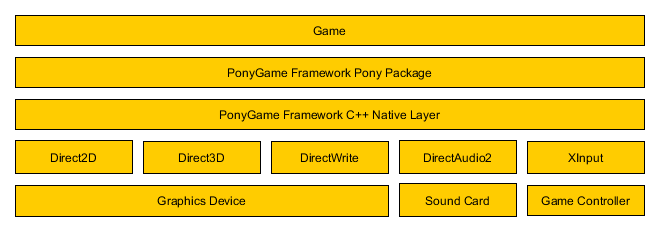

# PonyGame

PonyGame is a small open-source framework for creating DirectX games with Pony. [Pony](http://www.ponylang.org/) is an open-source, object-oriented, actor-model, capabilities-secure, high performance programming language. PonyGame allows you to write your entire game code in Pony, using all of these advantages.

## Setting Up PonyGame

PonyGame requires a running Pony compiler. Please refer to the [official Pony documentation](http://tutorial.ponylang.org/getting-started/) for learning how to get started with Pony.

## PonyGame Architecture

PonyGame applications consist of three layers:

1. Framework C++ Layer (Source/PonyGameNative)
1. Framework Pony Layer (Source/PonyGame)
1. Game Pony Layer (your game, i.e. Source/PonyGameExample)

While Pony supports integration with other native languages through the Foreign Function Interface (FFI), the native DirectX API tends to be very complicated, with a lot of parameters and complex return types. The _PonyGame Framework C++ Layer_ provides an easier interface for accessing hardware resources and performing common tasks such as creating a new window or drawing a text to the screen. When writing games in PonyGame, you won't have to know any details about this layer, but it's worth noting that it exists. If your games crashes, it's most likely because of a bug in that native layer (or a bug in Pony itself), because the Pony language is designed in a way that prevents applications from crashing. 

Only the most basic operations are performed by the C++ layer. The _PonyGame Framework Pony Layer_ is built on top of the C++ layer, wrapping common functionality by Pony functions. This layer features a framework that has been designed with common game architectures in mind. Features include:

* rendering text and images
* controller input handling
* component-based entity systems
* event-driven architecture
* game clock and FPS counter
* INI configuration files
* log files

Your game will be built on top of this Pony layer, including it just like any other package of the Pony standard library: 

    use "ponygame"

A detailed look at both framework layers and how to build your game on top of them follows further below.

## Getting Started

Games built with PonyGame have the same entry point as any other Pony application: The `Main` actor with a constructor taking an `Env` object as parameter. In this constructor, you should perform the following three steps, in order:

1. Construct a new `Game` instance.
1. Construct all of your game systems and add them to the game.
1. Start the game loop.

As stated above, this requires adding the `ponygame` package. Also, you need to include the native library, or the code will compile, but fail to link. Here's an example of a full `main.pony` source file:

    use "lib:PonyGameNative"

    use "ponygame"

    actor Main
        new create(env: Env) =>
            // Create game.
            let game = Game(env)

            // Add systems.    
            game.add_system(SpawnSystem(game))
            game.add_system(FallSystem(game))
            game.add_system(GridSystem(game))
            game.add_system(InputSystem(game))
            game.add_system(ScoreSystem(game))
            game.add_system(GridRenderSystem(game))
            game.add_system(HudSystem(game))
            
            // Start game.
            game.init_and_run()

PonyGame makes extensive use of the component-based entity system architecture, which you'll learn more about in a second. But before we take a deep dive into building clean and great games, let's take a final look into how to get everything running: We still need to compile our game. For the above code to compile, we need to hint the compiler where to find the native library.

    ponyc -p "Bin\PonyGameNative\x64\Debug" -p "Source" -o Bin\PonyGameExample Source\PonyGameExample

This call tells the compiler to include the native library, which can be found at `Bin\PonyGameNative\x64\Debug`, as well as the PonyGame framework, which can be found at `Source`. Then, it sets the output path to `Bin\PonyGameExample` and compiles the game source code from `Source\PonyGameExample`.

After you've compiled your game, you might want to make sure that you copy the `PonyGameNative.dll` over to your game binaries, as well as any game assets and configuration files you need.

`make-ponygame-example.bat` contains an example script for automating this build process.

## Adding Game Features

As stated above, PonyGame makes extensive use of component-based entity systems. If you're completely unfamiliar with this concept, take a look at some of the publications out there to get the general idea:

* [Evolve Your Hierarchy](http://cowboyprogramming.com/2007/01/05/evolve-your-heirachy/)
* [Entity Systems are the future of MMOG development](http://t-machine.org/index.php/2007/09/03/entity-systems-are-the-future-of-mmog-development-part-1/)
* [Game Models – A Different Approach](http://www.npruehs.de/game-models-a-different-approach-i/)
* [Component-based Entity Systems](http://unity-coding.slashgames.org/component-based-entity-systems-project-setup/)

In order to add a new feature to your game, such as falling Tetris blocks or scoring points, you need to create a new `GameSystem` class. You can pass a reference to the `Game` instance in the constructor. The `Game` will act as a facade to common game infrastructure, such as the renderer, configuration or logger. Game systems need to implement the following functions:

* `fun ref init(): Bool`: Called before the game is started. A good place for setting up the system and registering for important game events.
* `fun ref start(): Bool`: Called after all systems have been successfully initialized, and before the first update.
* `fun ref update(): Bool`: Called each frame. Allows you to tick your game logic.
* `fun draw(): None`: Called each frame. Allows you to render your game.

You should return `true` from these functions unless you encounter an error you cannot properly recover from. Returning `false` will cause the game loop to cancel and ultimately terminate the application.

## Designing Your Game Model

All game data in PonyGame is organized in `EntityComponent`s.

    use "ponygame"

    class PositionComponent is EntityComponent
        var x: I32
        var y: I32
    
    new create(x': I32, y': I32) =>
        x = x'
        y = y'
        
    fun component_type(): String =>
        "PositionComponent"

These components can be attached to entities by accessing the game entity manager:

    // Create entity.
    let entity = _game.entity_manager().create_entity()

    // Add position component.
    let position_component = PositionComponent(5, 0)
    _game.entity_manager().add_component(entity, position_component)

The entity manager also allows other systems to access the same components:

    // Make _falling_block entity fall down.
    let position_component = _game.entity_manager().get_component[PositionComponent](_falling_block, "PositionComponent")
    position_component.y = position_component.y + 1

Finally, you can remove entities that are no longer needed, along with all of their components:

    // Remove entity.
    _game.entity_manager().kill(block)

## Drawing Text and Images

Before you can draw any text or image to the screen, you need to load the appropriate resource.

    fun ref init(): Bool =>
        // Load font.
        _text_format_id = _game.resource_manager().load_text_format("Verdana", 16, HorizontalAlignmentLeft, VerticalAlignmentLeft)

        true

Then, you can draw from within your system's `Draw` function:

    fun draw(): None =>
        // Show FPS.
        let fps_string = "FPS: " + _game.fps_counter().fps().string()
        _game.renderer().draw_text(fps_string, 10.0, 10.0, _text_format_id, 1.0, 1.0, 1.0, 1.0)

Note that you're not allowed to draw outside the `Draw` function. Trying to do so will simply be swallowed by the game engine.

Images can be drawn the same way:

    fun ref init(): Bool =>
        // Load grid background.
        _grid_image = _game.resource_manager().load_image("GridBorder.png")

        true

    fun draw(): None =>
        // Draw grid background.
        _game.renderer().draw_image(_grid_image, 0, 0)

## Inter-System Communication

In PonyGame, the game logic benefits from a clean event-driven architecture. Instead of using references, systems communicate by the means of `GameEvent`s.

    use "ponygame"

    class PositionChangedEvent is GameEvent
        var entity: U64
        var old_x: I32
        var old_y: I32
        var new_x: I32
        var new_y: I32

    new create(entity': U64, old_x': I32, old_y': I32, new_x': I32, new_y': I32) =>
        entity = entity'
        old_x = old_x'
        old_y = old_y'
        new_x = new_x'
        new_y = new_y'

    fun event_type(): String =>
        "PositionChangedEvent"

These events can be pushed on to the game event manager:

    // Notify listeners.
    let position_changed_event = PositionChangedEvent(_falling_block,
        position_component.x,
        position_component.y - 1,
        position_component.x,
        position_component.y)
    _game.event_manager().push(position_changed_event)

Other systems may register as listener for these events, and handle them appropriately:

    fun ref init(): Bool =>
        // Register listeners.
        _game.event_manager().add_listener("PositionChangedEvent", this)
        
        true

    fun ref notify(event: GameEvent): None =>
        try
            _on_position_changed(event as PositionChangedEvent)
        end

    fun ref _on_position_changed(event: PositionChangedEvent): None =>
        let block = event.entity

        // Handle changed position ...

## Handling Input

The `Game` class provides access to the game `Input` for polling for controller state changes.

    fun ref update(): Bool =>
        try
            let position_component = _game.entity_manager().get_component[PositionComponent](_falling_block, "PositionComponent")

            // Handle input.
            if (position_component.x > 0) and (_game.input().dpad_left_just_pressed(0)) then
                // Move left.
                position_component.x = position_component.x - 1
            end
        end

        true

## Timing

The game clock allows you to time your game logic. It provides access to the total elapsed game time with the resolution of nanoseconds or milliseconds.

    try
        let fall_component = _game.entity_manager().get_component[FallComponent](_falling_block, "FallComponent")
        
        if (_game.clock().elapsed_millis() - fall_component.last_fall_time) >= _stay_duration_millis then
            // Fall down.
            // ...

            // Update timer.
            fall_component.last_fall_time = _game.clock().elapsed_millis()
        end
    end

## Configuration Files

PonyGame supports the established INI file format for configuring your game.

    [Game]
    GameName=Another Pony Game

    [Renderer]
    WindowWidth=1024
    WindowHeight=768

    [Diagnostics]
    LogLevel=Fine

The `GameName` is used as native window name, `WindowWidth` and `WindowHeight` specify the size of the render target. You can specify arbitrary additional configuration keys and access them from your game systems. The sections are ignored by the game and just used for improving the structure for human eyes.

    var game_name = _game.config()("GameName")
    var window_width = _game.config()("WindowWidth").i32()
    var window_height = _game.config()("WindowHeight").i32()

## Logging

You can use the game `Logger` for writing additional diagnostics information to the game log file:

    _game.logger().log("Block " + block.string() + " grounded.")

This file will be written to `ponygame.log` next to the game executable.

